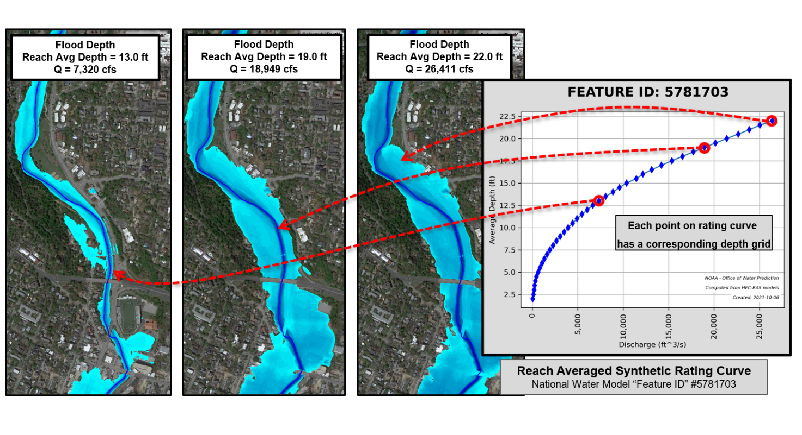

# RAS2FIM  <br> <br>
## <i>Creation of flood inundation raster libraries and rating curves from HEC-RAS models </i>


**Description**:  Starting with geospatially attributed one-dimensional HEC-RAS floodplain models, these scripts are used to create a library of flood depth inundation rasters for a range of storm water discharges (flow).  HEC-RAS models are cut to roughly match the limits of the [National Water Model's {NWM}](https://water.noaa.gov/about/nwm) stream designations (hydrofabric).  For each matching NWM stream, a synthetic rating curve is created based on 'reach averaged' flood depths as determined from the HEC-RAS simulations.  The intent it to create a library of flood depth inundation grids with a ccorresponding rating curve that can be paired with the National Water Model's discharges determination and forecasting to create real-time and predictive floodplain mapping from a detailed HEC-RAS 1-D model.

  - **Technology stack**: Scripts were all developed in Python 3.8.11.  Use is intended within a custom 'ras2fim' [Anaconda environment](https://www.anaconda.com/products/individual) running on a Windows OS.  Prior to running these scripts, the user is required to install and run [HEC-RAS v 6.3](https://github.com/HydrologicEngineeringCenter/hec-downloads/releases/download/1.0.25/HEC-RAS_63_Setup.exe).<br><br>
  - **Status**:  Version 1 - Inital release.  Refer to to the [CHANGELOG](CHANGELOG.md).<br><br>
  - **Related Project**:  Inspiration for this repository was to develop flood inundation map libraries to replace Height Above Nearest Drainage (HAND) as calculated with the [FIM inundation mapping](https://github.com/NOAA-OWP/inundation-mapping) repository.<br><br>
  - **Overview Video**: [Link to overview video of ras2fim](https://www.youtube.com/watch?v=TDDTRSUplVA)<br>
          Since the video was first produced, ras2fim has continued to evolve, but there is still valuable information in the video that you want to view. Notes for viewing:<br>
          The total runtime is 5 min and 41 seconds.<br>
          - The first part of the video shows folder pathing that has since been update and this part should be ignored. Updated folder pathing including donwloading from ESIP S3 is discussed later in this document.<br>
          - The second part, at appx 1:00 in, shows examples of how to run ras2fim.py and its parameters. This is also now out of date and should be ignored.<br>
          - When the video gets too appx 1:45 seconds and shows the ras2fim.py actively processing, it is still largely applicable.<br>
<br>

**RAS2FIM Wiki**:
More detail regarding RAS2FIM is located on the project's Wiki page.
<p align="center">
<a href="https://github.com/NOAA-OWP/ras2fim/wiki">

</a>
</p>

**Overview**:



## Default Folder Structure

While ras2fim.py and other tools have optional parameters allowing pathing to any folder(s), we do recommended folder structure as shown below based on your `c:` drive.


All documentation in this repo are based on the default folder structure.

## Downloading Data from ESIP

There are folders and files that will need to be downloaded locally prior to running the RAS2FIM code.  This data can be found in an Amazon S3 Bucket hosted by [Earth Science Information Partners (ESIP)](https://www.esipfed.org/). The data can be accessed using the AWS Command Line Interface (CLI) tools. AWS CLI installation details are shown below. This S3 Bucket (`s3://noaa-nws-owp-fim`) is set up as a "Requester Pays" bucket. Read more about what that means [here](https://docs.aws.amazon.com/AmazonS3/latest/userguide/RequesterPaysBuckets.html).

You will need permission from ESIP to access this data. Please contact Carson Pruitt (carson.pruitt@noaa.gov) or Fernando Salas (fernando.salas@noaa.gov) for assistance.


### Configuring the AWS CLI

1. [Install AWS CLI tools](https://docs.aws.amazon.com/cli/latest/userguide/install-cliv2.html)
2. [Configure AWS CLI tools](https://docs.aws.amazon.com/cli/latest/userguide/cli-configure-quickstart.html)

### To test AWS CLI and access to ESIP

To list folders prior to download:
```
aws s3 ls s3://noaa-nws-owp-fim --requester-pays
```

## ESIP Data Available

In the s3 bucket are two groupings of data.

- Sample: One is a full sample set of inputs required to run a small sample of ras2fim.py based on 12090301. It is recommended to download to the default folder structure against your `c:`, as per image above. This will allow you to run the `ras2fim.py` script with minimum arguments. It has a small sample of OWP_ras_models to allow for testing. This site does not talk about how to create OWP_ras_models but information can be found at the [RRASSLER tools](https://github.com/NOAA-OWP/RRASSLER) repo. 

To get all of the sample specific data please run:

```
aws s3 sync s3://noaa-nws-owp-fim/ras2fim/sample/ C:\ras2fim_data\ --requester-pays
```

- Data: A collection of various inputs files, some DEMS, some available models and outputs. Note: This is not an exhaustive collection of all OWP_ras_models, DEMs, catalog files, etc that are available for testing other models sets and HUCs. The additional data available for other HUCs, can be found and download at s3://noaa-nws-owp-fim/ras2fim/

It is also encourage to download the default folder structure `c:\ras2fim_data\` (as per image above). It is fine to downloading the `sample` and `data` S3 folders into the default. The full `data` S3 folder can be very large, so it is recommended to pick just key inputs and respective HUCs instead of the entire folder.


### AWS ESIP ras2fim Inputs Folder

The inputs folder, from either `sample` or `data`, includes the following files / folders listed below. Some files are shared for all `ras2fim.py` processing. Others require HUC8 specific files in key locations.

1. ALL: Watershed Boundary Dataset (WBD): WBD_National.gpkg.
2. PER HUC8: The WBD_National.gkpg split into different gpkg files by HUC8: /WBD_HUC8/*. Get the HUC8 specific gpkg you need and save it inside the \inputs\X-National_Datasets\WBD_HUC8\ folder.
3. ALL: National Water Model (NWM) Flowline Hydrofabric: nwm_flows.gpkg.
4. ALL: National Water Model to Watershed Boundary Lookup: nwm_wbd_lookup.nc.
6. PER HUC8: You will need a HUC specific ras2fim DEM which may exist in s3://noaa-nws-owp-fim/ras2fim/data/inputs/dems/ras_3dep_HUC8_10m/HUC8_{your huc number}_dem.tif. You can save it anywhere on your computer but it is suggested to save it at C:\ras2fim_data\inputs\dems\ras_3dep_HUC8_10m. `ras2fim.py` has optional arguments to path to this file in any location if you do not choose the default location. Note: The S3 "sample" folders already include the 12090301 DEM.
<br>
If that HUC8 DEM does not exist, you can create one using the `tools/acquire_and_preprocess_3dep_dems.py`. Include the argument of `-skips3` so it does not attempt to upload it to an S3 bucket unless you have your own. 


### OWP_ras_models_catalog.csv

At this point, `ras2fim.py` needs a file named `OWP_ras_models_catalog_{HUC8 Number}.csv`, and we have loaded `OWP_ras_models\OWP_ras_models_12090301.csv` for you in the S3 samples folder. It has some meta data that is used in the final output files. The file must have records that match models being processed. For the 'model_id' add any unique numbers you like. Please include it and also add the `-mc` argument to `ras2fim.py`. eg. `-mc c:\ras2fim_data\OWP_ras_models\OWP_ras_models_catalog_{the huc8 number}.csv` (or pathing of your choice of course, as is with most arguments). It is fine if the catalog has extra files as long as it has records to match the model folders names. 

### Testing ras2fim
If you like to setup your environment and run some sample tests, see the [INSTALL.md](doc/INSTALL.md) page.


## Dependency Sources

* [HEC-RAS Version 6.3](https://github.com/HydrologicEngineeringCenter/hec-downloads/releases/download/1.0.25/HEC-RAS_63_Setup.exe).
* [Anaconda](https://www.anaconda.com/products/individual) or [Miniconda](https://docs.conda.io/en/latest/miniconda.html) for Windows.
* National datasets - from AWS - See "AWS ESIP ras2fim Inputs Folder" section above.
* Runs on a Windows OS only - Tested on Windows 10.
* Tested on HEC-RAS 6.3 and default pathing is also set against v6.3.

## Limitations and Assumptions

Details coming soon.

## Known Issues & Getting Help

Please see the issue tracker on GitHub and the [Ras2Fim Wiki](https://github.com/NOAA-OWP/ras2fim/wiki) for known issues and getting help.

## Getting involved

NOAA's National Water Center welcomes anyone to contribute to the RAS2FIM repository to improve flood inundation mapping capabilities. Please contact Carson Pruitt (carson.pruitt@noaa.gov) or Fernando Salas (fernando.salas@noaa.gov) to get started.

----

## Open source licensing info
1. [TERMS](doc/TERMS.md)
2. [LICENSE](LICENSE)


----

## Credits and references

1. [Office of Water Prediction (OWP)](https://water.noaa.gov/)
2. [Goodell, C. R. (2014). Breaking the Hec-Ras Code: A User’s Guide to Automating Hec-Ras. H2ls.](https://www.kleinschmidtgroup.com/breaking-the-hec-ras-code-2/)
3. [Executive Summary, & Guidance, S. (n.d.). InFRM Flood Decision Support Toolbox. Usgs.Gov. Retrieved October 22, 2021](https://webapps.usgs.gov/infrm/pubs/FDST%20Map%20Submission%20Guidelines%20_vDec20.pdf)
4. [Collete, A. (2013). Python and HDF5: Unlocking Scientific Data. O’Reilly Media.](https://www.oreilly.com/library/view/python-and-hdf5/9781491944981/)
5. [Board on Earth Sciences and Resources/Mapping Science Committee, Committee on FEMA Flood Maps, Mapping Science Committee, Board on Earth Sciences & Resources, Water Science and Technology Board, Division on Earth and Life Studies, & National Research Council. (2009). Mapping the zone: Improving flood map accuracy. National Academies Press.](https://www.amazon.com/Mapping-Zone-Improving-Resilience-Preparedness/dp/0309130573)
6. [Dysarz, Tomasz. (2018). Application of Python Scripting Techniques for Control and Automation of HEC-RAS Simulations. Water. 10. 1382. 10.3390/w10101382. ](https://www.mdpi.com/2073-4441/10/10/1382)
7. [Documentation. (n.d.). River Analysis System. Army.Mil.](https://www.hec.usace.army.mil/software/hec-ras/documentation.aspx)

**Special Thanks to:** Cam Ackerman (US Army Corp of Engineers), Kristine Blickenstaff (US Geological Survey), Chris Goodell (Kleinschmidt Associates), Witold Krajewski (Iowa Flood Center), RoseMarie Klee (Texas Department of Transportation), David Maidment (University of Texas), Saul Nuccitelli (Texas Water Development Board), Paola Passalacqua (University of Texas), Jason Stocker (US Geological Survey), Justin Terry (Harris County Flood Control District)


