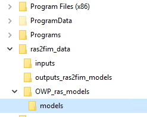

## Creating a RAS2FIM Conda environment


     
We recommend that you set up a Anaconda/Python environment for developing `ras2fim` that is separate from the "default" environment that you use in your own work/research.  This will allow you to utilize `ras2fim` without worrying about corrupting the Anaconda/Python environment on which your other work depends.

Below are instructions for building a separate development environment for using the `ras2fim` package using the [Conda](http://conda.pydata.org/docs/index.html) package management system.

### Step 1:
Download and Install [git](https://git-scm.com/downloads) to your Windows machine.<br>

### Step 2:
Download and Install [Anaconda](https://www.anaconda.com/products/individual) to your machine.<br>

### Step 3:
Clone a copy of the `ras2fim` repository on to your local machine.<br>
```
    git clone https://github.com/NOAA-OWP/ras2fim.git
```
### Step 4:
Open an **Anaconda Prompt** and navigate to the cloned directory.  Your path may vary.<br>


### Step 5:
In the Anaconda Promt, if this is a first time install, you can create the `ras2fim` conda environment from the cloned `environment.yml`.<br>
```
conda env create -f environment.yml
```

If you already have it installed, you can verify the `environment` is installed by typing `conda env list` and you should see a line for ras2fim.<br/><br/>
Next you need to do one pip install
```
pip install rasterio==1.3.5
```

This should make your environment ready to go.


### Step 6:
Activate the newly created `ras2fim` conda environment.<br>
```
conda activate ras2fim
```


### Step 7:
Change directories into the source `src` folder.<br>


### Step 8:
Run the `ras2fim.py` within the `ras2fim` conda environment with a help flag `-h` to verify that everything was installed.<br>
```
python ras2fim.py -h
```


### Step 9:
Now we need to setup the **default folder structure** for your inputs and outputs. All code will use this default structure to look for data. Howver, most code will let you override any folder to your own pathing, and you can build your own folder structure. 

To setup your enviroment **default** folders:
```
a) Make a directory at your c: called ras2fim_data
b) Make the following subfolder with these names and case `inputs`, `OWP_ras_models`, `outputs_ras2fim_models`. Inside the `OWP_ras_models` folder, make another subfolder called `models`.
```
The default folder structure will look like this:


### Note:
If you have VSCode installed, after Step 6 (activate ras2fim), you can type<br>
```
code
```
and it will launch VSCode as your editor. You will be able to debug and test within VSCode if you like.
