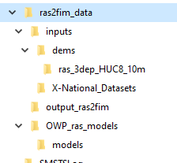
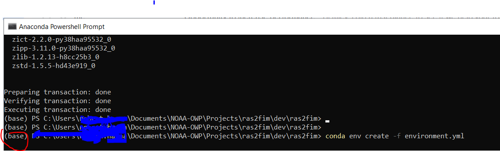
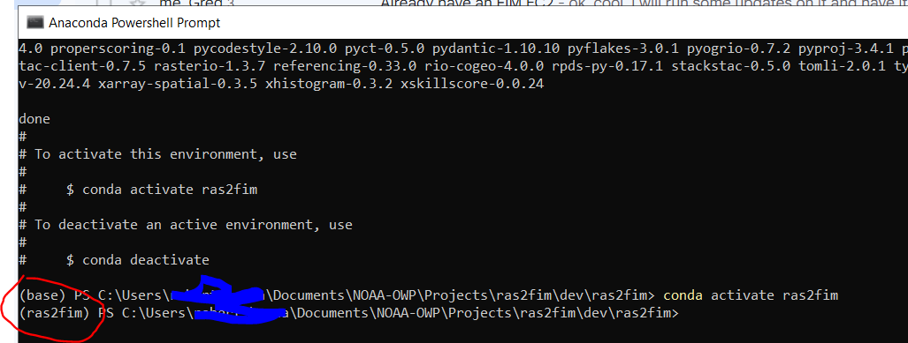
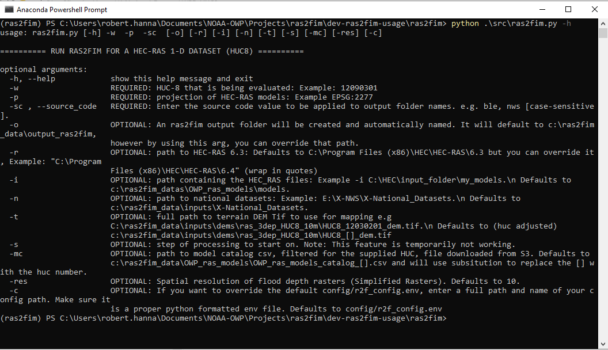

## Using and testing ras2fim.py


### Follow the steps below to get your environment setup and run some tests.
<br/>
     
### 1: Default Folder Structure

It is strongly encourage to create the following folder structure on the `c:` of your windows machine. Almost all scripts in this system allow for optional overrides for differnt pathing, but most notes in this document will use defaulted, minimum arguments.




#### Prior to Downloading and Running the Code

If you have not already done so, download data from ESIP as per the `README.md` page. 

The `model` folder includes a number of sub-folders, one per model, that has gone through preprocessing steps to convert some raw HEC-RAS data to data which can be processed by `ras2fim.py`. `ras2fim.py` will create output rating curves, REMs and other output files.  All subfolders in the `OWP_ras_models\models\` folder will be attempted to be processed when running ras2fim, so please use caution to ensure they are in your stated HUC8 value. `ras2fim.py` has an argument which lets you override the folder location of where it looks for model folders, allowing you more flexibility on folder/file management.

To keep models organized on your local machine, it is common to create subfolders with huc related folders such as OWP_ras_models\12090301_sample_models\ (model folders in here). Then add the `-i` argument to `ras2fim.py` pointing to this adjsuted folder. The sample data and examples will follow this model folder override pattern via `c:\ras2fim_data\OWP_ras_models\12090301_models\`.

As mentioned on previous pages, you are also welcome to create some of your own OWP_ras_models using RRASSLER or your own tools. 
<br><br>

### 2: Install HEC-RAS verion 6.3
These RAS2FIM scripts are written to utilize the computational engine and supporting APIs from the U.S Army Corp of Engineers' [Hydrologic Engineering Center's River Analysis System {HEC-RAS}](https://www.hec.usace.army.mil/software/hec-ras/).  Download and install **HEC-RAS version 6.3** to your local machine.  Note: **the version (6.3) matters!**
<br><br>
The install package can be downloaded from [the USACE website](https://github.com/HydrologicEngineeringCenter/hec-downloads/releases/download/1.0.25/HEC-RAS_63_Setup.exe). Once installed, **open HEC-RAS on that machine** to accept the terrms and conditions and ensure that it will function on that machine prior to running any RAS2FIM scripts. Close HEC-RAS.
<br><br>

### 3: Clone the Git-hub repository
 Install [git](https://git-scm.com/downloads) onto your Windows machine. Next, clone this ras2fim reporitory on to your Windows machine (see note below). Path to the windows folder of your choice. e.g. C:\Users\my_user\Documents\NOAA-OWP\Projects\test\, then type:
```
git clone https://github.com/NOAA-OWP/ras2fim.git
```
<br>

### 4: Building the Anaconda Environment

You will need to set up an Anaconda/Python environment for developing `ras2fim` that is separate from the "default" environment that you use in your own work/research.  This will allow you to utilize `ras2fim` without worrying about corrupting the Anaconda/Python environment on which your other work depends.

Below are instructions for building a separate development environment for using the `ras2fim` package using the [Conda](http://conda.pydata.org/docs/index.html) package management system.

Download and Install [Anaconda](https://www.anaconda.com/products/individual) to your machine.<br>
<br>

### 5: Creating and Activating conda ras2fim

Open an **Anaconda Powershell Prompt** and navigate to the cloned directory. e.g. C:\Users\my_user\Documents\NOAA-OWP\Projects\test\ras2fim.  Your path may vary.<br>


Next create the `ras2fim` conda environment from the cloned `environment.yml` (it can take a few minutes to complete).<br>
```
conda env create -f environment.yml
```


Now activate it for use.
```
conda activate ras2fim
```

### Rebuilding the ras2fim conda environment

Sometimes new releases will require the ras2fim conda environment to be updated. Using then Anaconda Powershell Prompt tool, again navigate to your cloned directory. e.g. C:\Users\my_user\Documents\NOAA-OWP\Projects\test\ras2fim_agency_20211018
- If you are already in an activated environment, you will need to get out of it. You will know if you are in it when it says **ras2fim** at the start of the line.<br>
    ```
    conda deactivate
    ```
    
- Remove the ras2fim environment (it can take a few minutes to complete)<br>
    ```
    conda remove --name ras2fim --all -y
    ```
    
- Recreate the environment (it can take a few minutes to complete)<br>
    ```
    conda env create -f environment.yml
    ```
    
- Reactivate the enviroment<br>
    ```
    conda env create -f environment.yml
    ```
    

### 6: Get Data
You will now need some data.

If you have not already done so, you will need to downloaded some files/folders from ESIP. See the [README](../README.md) file for more details on ESIP access. 

You now need the `inputs` and `OWP_ras_models` folders and the HUC8 specific `OWP_ras_models_catalog_{HUC8 Number}.csv` as mentioned in the [README](../README.md). Downloading these two folders will give you some default data that is required. Of course, you are welcome to override or experiment with some of this data as you see fit.
<br><br>
### ------------------------------------------------------------
### --- You are now ready to start processing ras2fim models ---
<br>
### Bad Models System

The name `Bad Models` does automatically mean there is bad data in a given folder, it just means there are potentially some incompatability with `ras2fim.py`.

There is a wide number of ways that a model can fail in `ras2fim.py`. Many scenarios are being programatically caught and logged throughout the code. However, if all else fails, you can put that folder name in the souce code `config\bad_models_list.lst` which will skip that folder during processing.
<br/><br/>

## Usage


### 7: Running ras2fim.py
Each time you want to run ras2fim.py or other tools, you need to activate your ras2fim conda environment.
```
conda activate ras2fim
```


The main script is titled `ras2fim.py`.  **All scripts have a helper flag of `-h`**.  It is recommended that you run the script with the helper flag first to determine the required input. Also read the sample usage notes near the bottom of `ras2fim.py` code file.<br><br>

<br>
***--- Image may be out of date slightly as parameters are being adjusted currently ---***
<br><br>
**Note**: Currently, there are **three required** arguments and a number of optional arguments. Below is a sample input string to execute the `ras2fim.py` script with most arguments defaulted. The defaults arguments are based on the default folder structure shown in the [README](../README.md).
```
python ras2fim.py -w 12090301 -p EPSG:2277 -sc ble
```

**Note:** The `-p` argument is the incoming projection of the models that are about to be processed. All HEC-RAS model folders, such as folders from OWP_ras_models\models, must match that projection. The `-res` argument defaults to `10` but it must match the resolution of the incoming HEC-RAS model files.  At this point, only 10 meter has been tested, and more details and options coming soon.
<br><br>

### Editors

You can use any editor you like, but if you are a fan of VSCode and have it installed, you can type `code` in your Anaconda Powershell Prompt window and it will launch VSCode as your editor. With some VSCode additional setup, you will be able to do line-by-line (step) debugging if you like.  [Click here](https://code.visualstudio.com/docs/python/debugging) for more details.
<br>
<br>

### Additional Tools

There are a wide range of other tools, in the `tools` directory, you may use that can help with processing and data gathering. Most of them are generally for NOAA/OWP use only as it relies on having access to our S3 bucket. However, if you have your own S3 and set it up with a matching default folder structure, you are welcome to use the scripts. Please read informaton in those scripts carefully, notes at the top of the script and bottom especially. You will also need some form of permissiosn to reach your bucket such as an aws config profile.

